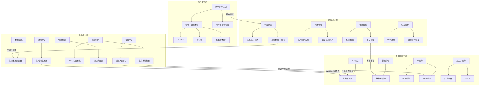

```mermaid
graph TD
    %% 用户交互层（直接价值体现）
    subgraph 用户交互层
        A1[统一门户入口] --> A2[多端一致性体验]
        A1 --> A3[用户身份与权限]
        A2 --> B1[Web/H5]
        A2 --> B2[移动端]
        A2 --> B3[桌面端/插件]
    end

    %% 前端核心层（技术价值）
    subgraph 前端核心层
        C1[UI组件库] --> C2[交互设计系统]
        C1 --> C3[动态数据可视化]
        C4[状态管理] --> C5[用户操作历史]
        C4 --> C6[批量任务队列]
        C7[性能优化] --> C8[按需加载]
        C7 --> C9[缓存策略]
        C10[安全防护] --> C11[XSS过滤]
        C10 --> C12[敏感操作验证]
    end

    %% 业务功能模块（与前端深度绑定）
    subgraph 业务能力层
        D1[数据快查] --> D11[实时数据仪表盘]
        D2[创意制作] --> D21[富文本编辑器]
        D2 --> D22[AIGC内容预览]
        D3[智能报表] --> D31[交互式图表]
        D4[任务中心] --> D41[进度可视化]
        D5[通知中心] --> D51[实时消息推送]
    end

    %% 后端服务层
    subgraph 数据与服务层
        E1[API网关] --> E2[业务微服务]
        E3[数据中台] --> E4[数据库/数仓]
        E5[AI服务] --> E6[NLP引擎]
        E5 --> E7[AIGC模型]
        E8[第三方服务] --> E9[广告平台]
        E8 --> E10[BI工具]
    end

    %% 数据流与价值链路
    A1 -->|用户请求| C1
    C3 -->|可视化渲染| D11
    D21 -->|内容生成请求| E7
    D41 -->|任务状态同步| E2
    D51 -->|WebSocket推送| E2
    C9 -->|本地缓存| E4
```