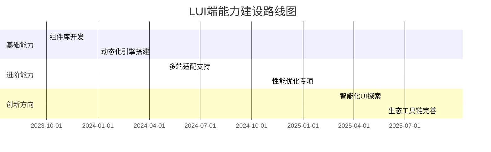

```mermaid
gantt
    title LUI端能力建设路线图
    dateFormat  YYYY-MM
    section 基础能力
    组件库开发       :2023-10, 3m
    动态化引擎搭建   :2024-01, 4m
    section 进阶能力
    多端适配支持     :2024-05, 6m
    性能优化专项     :2024-11, 4m
    section 创新方向
    智能化UI探索     :2025-03, 6m
    生态工具链完善   :2025-09, 6m
```