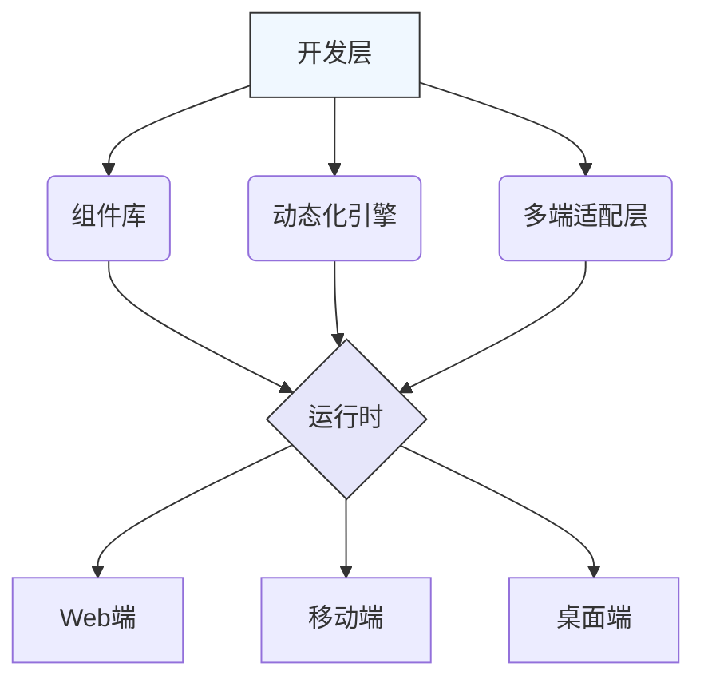

```mermaid
graph TB
  A[开发层]--> B(组件库)
  A --> C(动态化引擎)
  A --> D(多端适配层)
  
  B --> E{运行时}
  C --> E
  D --> E
  
  E --> F[Web端]
  E --> G[移动端]
  E --> H[桌面端]
  
  style A fill:#F0F8FF,stroke:#333
  style E fill:#E6E6FA,stroke:#333
```